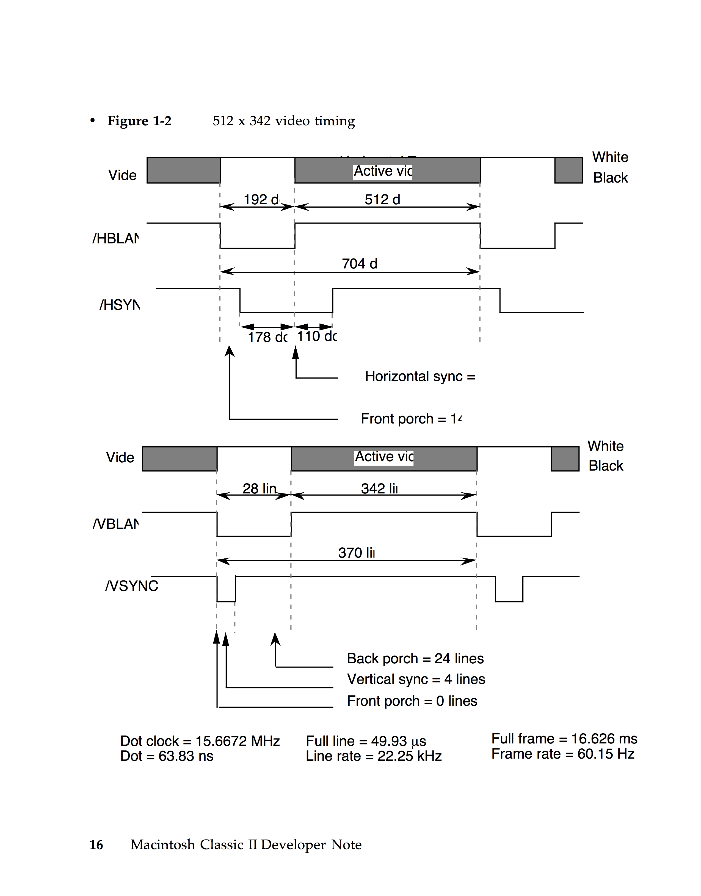

# MacSE_CRT_Controller_Test
FPGA Design Files for driving MacSE with Video, HSYNC, and VSYNC

# Usage
example: make TIME=500ns

Use GTKWave to view resulting simulation

# Notes
Currently intended to be used with IceStorm/IceCube 2

You will need to modify the PLL to use with Altera for example
# Dependencies
* GHDL
* GTKWave

# Status
All files compile, need to udate CRT.vhd to actually drive a test

pattern such as a blank screen

Schematic overview coming soon.

# Design
## Timing Diagram

